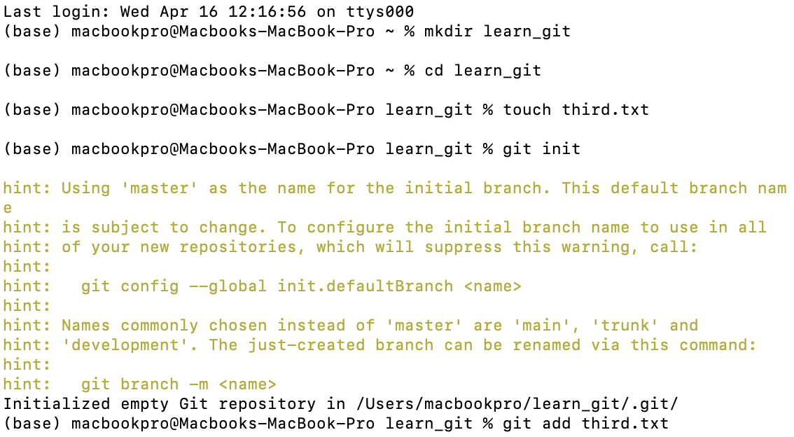
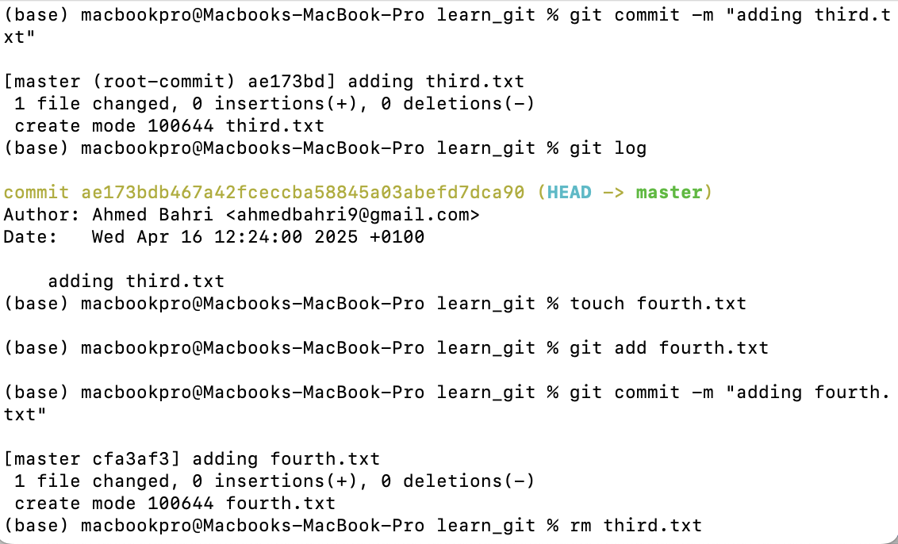
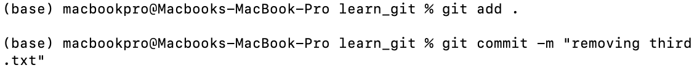
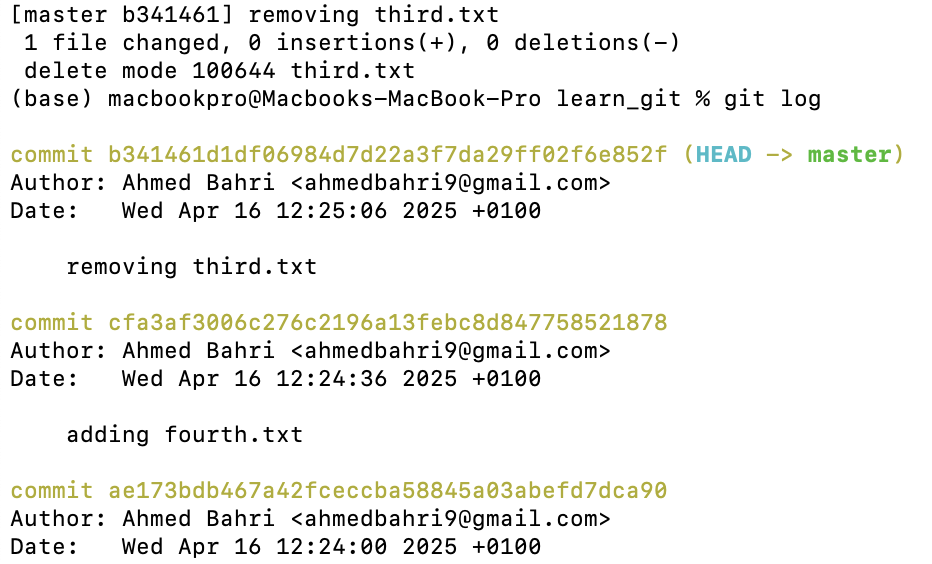
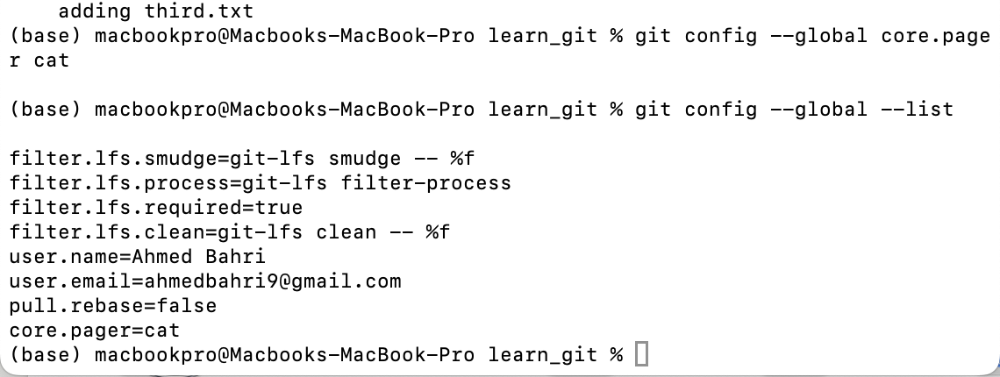

# Git Workflow with Screenshots

## Step 1: Initial Setup
In this step, we created a folder called `learn_git` and initialized an empty Git repository inside it. 
We also created the `third.txt` file, added it to the staging area, and committed it to Git.
**Screenshot 1: Initial Git Setup and First Commit**

*Explanation of the first commit: Adding the `third.txt` file to the repository.

## Step 2: Adding More Files
Next, we created the `fourth.txt` file and added it to the staging area. Then we committed the file to the Git repository.
**Screenshot 2: Adding `fourth.txt` File**

*Explanation of the second commit: Adding the `fourth.txt` file to the repository.

## Step 3: Removing a File
In this step, we removed the `third.txt` file from the repository. We then added this change to the staging area and committed it.
**Screenshot 3: Removing `third.txt` File**

*Explanation of the third commit: Removing the `third.txt` file.

## Step 4: Configuring Git
We configured Git to use `cat` as the pager, which makes it easier to view logs and commands. Then we pushed the changes to the remote repository on GitHub.
**Screenshot 4: Configuring Git**

*Explanation of the fourth commit: Configuring Git settings and pushing the changes to GitHub.

## Step 5: Verifying Changes and Pushing to GitHub
Finally, we verified all the changes with `git log` and pushed the final commit with the updated configuration to GitHub.
**Screenshot 5: Verifying Changes**

*Explanation of the fifth commit: Verifying the changes and pushing to the GitHub repository.

